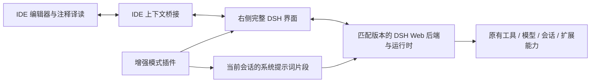

# IDE 右侧完整 DSH Agent 与增强模式方案

调研日期：2026-09-11。项目基线：`master-idea`、`ef99974`。DSH 源码核查基线：[c291e7961a515f6d7af9304e7fd1d257929aef26](https://github.com/deepseek-ai/deepseek-harness/tree/c291e7961a515f6d7af9304e7fd1d257929aef26)。本文为方案，尚未实现或进行 IDE 内运行验证。

本文已按用户最新明确的需求重写：右侧是完整 DSH Agent 对话窗口，助教等增强模式通过系统提示词实现。实施范围以本文为准。

## 产品定义

**现有注释译读 + IDE 右侧完整 DSH Agent + 可切换的提示词模式 + IDE 上下文增强。**

右侧窗口可以直接发起任意正常 Agent 任务。DSH 现有的读写文件、执行命令、工具调用、会话、模型设置、权限交互及插件扩展入口应完整保留。助教是对当前 Agent 工作方式的增强；选择助教后，用户仍然可以要求修改代码、运行示例或测试。

“全部能力”的验收基线，是固定 DSH 版本在相同配置下提供的完整 Web 产品与运行时。DSH 原有 preset、已安装插件、模型配置及权限策略继续决定实际可用能力；我们的模式切换不额外删减工具，也不自动改变权限等级。无需把所有第三方插件预装进 IDE 安装包。

## 窗口和使用流程

当前主线为 IDEA，建议使用右侧 ToolWindow 承载 DSH 完整界面。源码留在编辑区；右侧窗口提供会话、输入框、工具过程、停止/继续、模型选择、设置等原有交互，并增加模式选择和代码上下文入口。

1. 点击右侧 Agent 图标，进入完整 DSH 对话界面；普通提问或执行任务都从这里开始。
2. 输入区附近选择“通用 / 助教 / 审查 / 译读 / 自定义”。首版可只提供通用、助教、自定义。
3. 编辑器选中代码后，右键“发送到 Agent”或“用助教讲解”，自动打开右侧并添加选区附件。
4. “用助教讲解”同时选中助教模式，填入或发送明确的讲解请求；不要求用户复制系统提示词。
5. 用户继续追问，或要求读取其他文件、写一个例子、运行测试，均由同一个 DSH Agent 处理。
6. 同一会话可切换增强模式，历史保留；执行中的轮次完成后，新模式从下一轮生效。

原有注释自动翻译、原位显示和缓存继续作为阅读入口；选区可以包含代码、原注释及已有译文。

## 模式本质：会话级系统提示词

| 模式 | 自动加入的行为引导 | 底层能力 |
| --- | --- | --- |
| 通用 | 使用原有 DSH 行为，不附加业务模式提示词 | 当前 DSH 完整能力 |
| 助教 | 优先帮助理解，按程度解释，结合真实源码、例子与追问教学 | 同上 |
| 审查 | 关注正确性、边界、影响范围与验证证据，说明问题位置 | 同上 |
| 译读 | 结合代码语境解释注释、文档和专业术语 | 同上 |
| 自定义 | 使用用户保存的模式提示词 | 同上 |

建议的助教提示词初稿：

> 你是一名编程助教，目标是帮助用户理解当前项目和代码。根据用户已有知识调整解释深度，默认用简体中文，保留必要的代码标识符和专业术语。先概括用途，再围绕用户的问题解释执行过程、设计原因和边界情况。需要上下文时，主动使用现有工具查看真实定义、调用位置和测试，引用具体源码。用小例子或对照写法辅助理解，按需提出一道检验理解的问题。当用户要求修改代码、运行示例或测试时，使用现有 Agent 能力完成，并解释操作与结果。明确区分源码证据、推断和实际运行结果。

这是新增的模式内容，最终措辞应在实际项目中调整。模式可以编辑、另存为自定义版本。

### DSH 的对应扩展点

官方 `dsh-system-prompt` 支持通过 `ctx.systemPrompt.section(...)` 注册提示词片段；在 Agent scope 下注册只影响对应会话。可以保留 DSH 自带提示词与工具说明，并添加当前模式片段。[系统提示词机制](https://github.com/deepseek-ai/deepseek-harness/blob/master/packages/core/system-prompt/README.md)

建议为本插件定义一个稳定的模式片段名称，例如 `comment-translator:mode`。通用模式移除该片段；切换模式时替换同一片段，避免助教、审查等旧提示词不断叠加。应记录 mode ID、提示词版本和生效轮次，以便恢复会话时重新装配。

模式描述属于系统指令；选区、文件和诊断属于任务上下文，应作为附件或上下文数据进入会话，避免把源码字符串拼成系统指令。

不要用 `complete: true` 覆盖整个 DSH system prompt；需要保留引擎已有行为、工具说明和项目规则。具体拼装顺序与持久化恢复需要通过目标版本验证。

### 与 DSH 原生 preset 的关系

DSH 原生 agent preset 会改变工具、技能及提示词的组合；官方目前只允许空会话切换 preset。它与这里可随对话切换的“助教模式”职责不同。[原生 preset 规则](https://github.com/deepseek-ai/deepseek-harness/blob/master/packages/preset/agent-presets/README.md)

因此，保留原生 preset 选择，在其上增加单独的增强模式层。切换助教只更新本插件的提示词片段，不重新构建原生 preset。默认模式与单个会话当前模式分开保存，避免影响其他对话。

## 接入路线：优先复用完整 DSH Web 产品

官方 Web 应用已经提供交互聊天、模型与设置管理、会话历史，并沿用 DSH 的运行能力。应围绕这条完整产品链路做 IDE 集成。[Web 应用说明](https://github.com/deepseek-ai/deepseek-harness/blob/master/packages/bundle/web-app/README.md)

### IDEA：右侧 ToolWindow + JCEF

IntelliJ 支持注册 `anchor="right"` 的 ToolWindow，JCEF 支持在 IDE 内加载网页。首个原型可启动匹配版本的 DSH Web 运行时，使用 `--no-open`，让 JCEF 在自身顶层页面打开受控的本地 DSH 地址。[ToolWindow](https://plugins.jetbrains.com/docs/intellij/tool-windows.html)、[JCEF](https://plugins.jetbrains.com/docs/intellij/embedded-browser-jcef.html)

原型先保留完整官方界面，再通过 DSH 前端扩展增加模式选择与 IDE 桥接。侧栏适配可以折叠导航或调整宽度，但模型设置、会话管理、工具交互及扩展入口都要可达。

这比自己重写全部聊天、审批、工具卡片和历史界面更有利于跟随上游；JCEF 登录跳转、Cookie、流式连接、下载、剪贴板和外部链接处理仍需真实验证。JCEF 不可用时应明确说明当前环境限制，不能把外部浏览器方案算作已完成右侧窗口。

### VS Code：保留完整界面，单独验证承载方式

VS Code 可以使用 Webview View 承载侧栏界面，但它不是普通的顶层浏览器页面。DSH 当前 Web 鉴权包含 `HttpOnly`、`SameSite=Strict` Cookie 以及 Host/Origin 检查，不能假定套一个 iframe 或直接从 Webview fetch localhost 就能正常工作。[Webview API](https://code.visualstudio.com/api/extension-guides/webview)、[DSH 浏览器连接与鉴权](https://github.com/deepseek-ai/deepseek-harness/blob/master/packages/client/connection/README.md)

若 VS Code 需要适配传输层，应复用 DSH 的完整前端能力，通过宿主桥接适配 RPC、实时流和资源传输。DSH connection 已区分 Web carrier 与 shell-owned carrier，可作为工程调查入口；此处不是已验证的 VS Code 适配器。不能仅解决发消息接口便宣布功能对齐。

源码已有启动前注入 `globalThis.__DSH_TRANSPORT__` 的接口，支持 RPC/流和 bundle 加载；附件另有 `__DSH_FILE_UPLOAD__`。可以据此调查 Webview 与扩展宿主的消息桥接，并复用完整客户端组合。仍需适配动态资源、下载、连接恢复和宿主 CSP。[传输接口](https://github.com/deepseek-ai/deepseek-harness/blob/master/packages/client/connection/src/client/index.ts)、[附件传输](https://github.com/deepseek-ai/deepseek-harness/blob/master/packages/client/file-upload/README.md)

### 前端复用的范围

DSH 的 conversation 包是会话组装与浏览器 shell，具体 Chat、输入、交互及工具渲染依赖其他客户端包。接入时应保留匹配版本的完整客户端组合，不能把单独一个 `ui-conversation` 当作可直接嵌入的完整聊天组件。[Conversation 说明](https://github.com/deepseek-ai/deepseek-harness/blob/master/packages/client/ui-conversation/README.md)

### SDK / ACP 调研结论仍然有效，但适用范围改变

官方 TS SDK 当前缺少轮次内取消及反向审批请求，事件通知不等于实时 token 流。DSH ACP 支持取消、权限及会话恢复，但当前面向自动化，省略部分界面交互和原始 token 输出。[SDK](https://github.com/deepseek-ai/deepseek-harness/blob/master/packages/sdk/client/README.md#known-limitations-and-deferred-work)、[ACP](https://github.com/deepseek-ai/deepseek-harness/blob/master/packages/acp/acp/README.md)

这些限制说明我们需要完整 Web/客户端接入路径，不构成减少产品能力的理由。SDK/ACP 可用于专项验证或其他集成，不作为完整右侧窗口唯一的连接协议。

## 我们需要新增的模块

| 模块 | 职责 |
| --- | --- |
| IDE 侧栏宿主 | 创建右侧窗口、聚焦、处理主题与生命周期 |
| DSH 运行时管理 | 固定版本启动、就绪检测、项目绑定、崩溃诊断与退出清理 |
| IDE 上下文桥 | 发送选区、未保存缓冲区、文件 URI/范围/版本，支持回到源码 |
| DSH 增强模式插件 | 模式选择、系统提示词片段、自定义模式配置与会话恢复 |
| 完整客户端承载适配 | 保留上游界面与交互，处理宿主传输和资源访问差异 |

现有 VS Code 模型配置、凭据读取和 Webview 消息校验可借鉴；IDEA 已有的项目/编辑器定位可复用。当前两端翻译请求都非流式，IDEA 阅读器只是只读文件快照，均不能直接充当完整 DSH 对话窗口。

DSH 自己的会话与配置由 DSH 管理；现有翻译 SQLite 继续保存译文。可以提供“沿用翻译模型设置”的便捷操作，但要验证工具调用和参数兼容性，不应每次启动覆盖用户在 DSH 中修改的设置。

## 实施顺序与验收

1. **先验证完整右侧 DSH。** 在当前 IDEA 主线接上完整 Web UI，验证聊天流、停止、工具调用、权限交互、会话历史、模型设置及扩展入口。
2. **加入通用 / 助教模式。** 验证系统提示词真实生效、只影响当前会话、切换后不累积旧模式，工具集合及权限配置保持原有语义。
3. **连接源码与翻译入口。** 选区发送、文件引用、未保存代码、源码跳转；用户可以从助教解释自然继续要求修改和运行。
4. **增加自定义模式和其他编辑器承载。** 复用 DSH 插件与模式配置，分别完成宿主适配与完整功能对齐验证。

“完整能力”验收应拿同一 DSH 版本、同一原生 preset/插件/模型/权限配置，在浏览器和 IDE 内执行相同任务，逐项比对交互与结果。尤其覆盖运行中停止、审批、命令/文件工具、历史恢复、模式切换和插件提供的界面入口。

当前尚未做右侧窗口端到端原型，暂不沿用上一轮片段助教的开发工期估算。主要不确定性在完整客户端承载与宿主桥接，模式提示词本身是较小的一层。

## 版本与运行环境备注

DSH 当前属于 developer preview，需要固定前后端及扩展的匹配版本。核查时 SDK `latest` 与 DSH `latest` 标签不一致，两者 `next` 为 `0.1.5-rc.2`；不能混用最新源码文档与旧发布包。根仓库要求 Node `^22.19.0 || >=24.0.0`。[官方仓库](https://github.com/deepseek-ai/deepseek-harness)、[固定提交的 package.json](https://github.com/deepseek-ai/deepseek-harness/blob/c291e7961a515f6d7af9304e7fd1d257929aef26/package.json)

启动时需要保留 DSH 原有鉴权流程，启动 URL 中的凭据不能写入普通日志。项目目录、会话归属、已有 DSH 服务是否由插件启动，需要区分清楚；插件只清理自己拥有的进程。远程开发需要保证 DSH 的执行目录与代码所在环境一致。
